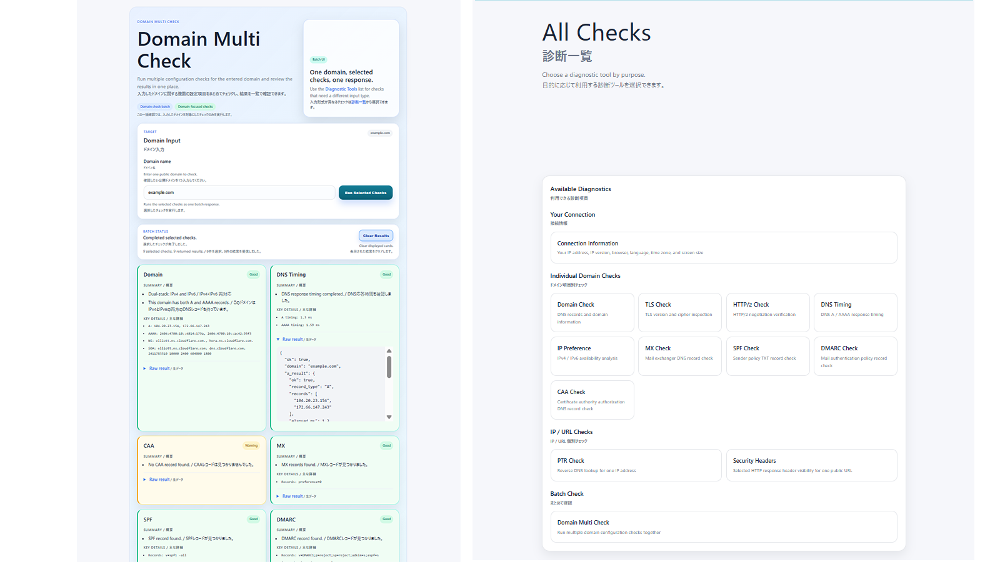

# Network Check

Network Checkは、公開されているDNS、TLS、HTTPなどの情報を外部から読み取り、結果を表示するread-onlyの確認サービスです。ドメイン名、IPアドレス、公開URLを用途に応じて入力し、現在観察できる情報を確認できます。

セキュリティ診断、脆弱性検査、侵入試験を行うサービスではありません。表示結果だけで、対象サービス全体の正常性や安全性を保証することもできません。

## Architecture

Network Checkは、共通のcheck coreとUIから独立したapplication logicを再利用し、公開先ごとのUI / presentationをcompositionで組み立てられる構成です。check logicをサイトごとに複製する方式ではなく、同一source内のmodule boundaryによる再利用です。別HTTP serviceやmicroserviceとしてcoreを分離する構成ではありません。詳細は[Project Overview](docs/PROJECT_OVERVIEW.md)を参照してください。

## 主な確認機能

- Client Information
- Domain、DNS Timing、IPv4 / IPv6 Preference
- TLS、HTTP/2、Security Headers
- MX、SPF、DMARC
- PTR、CAA
- Domain Multi Check
- Public Explanation Pages

機能ごとの表示項目、結果の読み方、利用例、限界は[Checks](docs/CHECKS.md)を参照してください。

## 何が分かるか

- アプリケーションから見える接続元IPの種類とrequest headerの一部
- 公開DNSレコードと、A / AAAAの有無によるIPv4 / IPv6対応状況
- DNS問い合わせ時間の参考値
- 標準ポート443で接続したときのTLS version、cipher、証明書情報
- `https://example.com/`形式のURLに対するHTTP versionとHTTP status
- メール配送先や公開されている送信・認証方針のDNSレコード
- IPアドレスのreverse lookup、CAAレコード、選択したHTTP response headerの有無

## この結果だけでは分からないこと

- サービス全体が正常に稼働しているか
- Webサイトやサーバーに脆弱性がないか
- OSやブラウザが実際に選択したすべての通信経路
- メールが必ず配送されるか、実際のメールが認証を通過するか
- DNSやHTTPの性能全体

HTTP/2確認はredirectを自動追跡せず、crawlや性能測定も行いません。実行環境の`curl`がHTTP/2非対応の場合は`unavailable`を表示します。

## 安全上の境界

- 対象システムの設定やデータを変更しません。
- ポートスキャン、脆弱性診断、認証試行、メール送信を行いません。
- TLSとHTTP/2は標準ポート443への通常接続だけを行います。
- Security Headersはpublic HTTP / HTTPS URLだけを受け付け、埋め込み認証情報、非標準ポート、localhost、private・reserved・non-public addressを拒否します。
- Security Headersもredirectを自動追跡しません。

## ネットワーク接続の安全方針

Network Checkは、利用者が入力したドメイン名、IPアドレス、URLに対して外部ネットワーク確認を行う前に、接続先を検証します。

公開向けの確認リクエストが、内部サービスや非公開ネットワークへのアクセスに使われないよう、ループバック、プライベート、リンクローカル、マルチキャスト、予約済み、その他の非公開または通常の公開診断対象として扱うべきではないアドレス範囲を拒否、または回避するように設計しています。

また、接続先の境界が変わる可能性がある確認処理では、リダイレクト追跡を制限します。

詳細は[Security Policy](docs/SECURITY_POLICY.md)を参照してください。この公開リポジトリでは、内部の実行環境、デプロイ設定、運用しきい値、ログ、不正利用対応などの内部運用情報は公開対象に含めません。

Network Checkは、公開されている通常のネットワーク情報を確認するためのツールです。脆弱性スキャナ、侵入テストツール、ペネトレーションテストツール、認可回避ツールとして使用することを目的としていません。

### 公開安全モデル

- Layer 1 — Application: 外部接続の前に宛先を検証し、non-public targetを拒否するdestination-safety / SSRF-risk mitigationを実装しています。接続先の境界が変わり得る確認ではredirectを自動追跡しません。
- Layer 2 — Reference deployment: endpoint-specific rate limitingは、API abuse mitigationのためのenvironment-specific controlです。この公開Repositoryのportable application logicではありません。

## Domain Multi Check

`/multi-check`と`/network-check/`では、次の9項目から選択してまとめて実行できます。

- Domain
- DNS Timing
- CAA
- MX
- SPF
- DMARC
- TLS
- HTTP/2
- IPv4 / IPv6 Preference

PTRはIPアドレス、Security HeadersはURLを入力するため、Domain Multi Checkには含まれません。

## 主なroute

| Route | 内容 |
|---|---|
| `/` | Client Information |
| `/checks` | 個別確認機能の一覧 |
| `/network-check/` | 公開向けNetwork Check |
| `/network-check/guide/` | Public Explanation Pagesの一覧 |
| `/network-check/{slug}/` | 各確認項目の説明ページ |
| `/multi-check` | Domain Multi Check |
| `/domain`、`/dns-timing`、`/ip-preference` | DNSとIP対応状況 |
| `/tls`、`/http2`、`/security-headers` | TLSとHTTP関連情報 |
| `/mx`、`/spf`、`/dmarc` | メール関連DNS情報 |
| `/ptr`、`/caa` | PTRとCAA |
| `/privacy`、`/terms`、`/contact` | 公開方針と連絡先 |
| `/health` | application health response |

## スクリーンショット



## ローカル起動

Python 3.9以降を使用します。

```bash
git clone https://github.com/mars70s/network-check-public-export.git
cd network-check-public-export
python3 -m venv venv
source venv/bin/activate
pip install -r requirements.txt
uvicorn main:app --reload
```

Windows PowerShellではvirtual environmentを次のように作成・有効化できます。

```powershell
py -3 -m venv venv
.\venv\Scripts\Activate.ps1
pip install -r requirements.txt
uvicorn main:app --reload
```

起動後、`http://127.0.0.1:8000`を開きます。

環境変数は`.env.example`を参考に`.env`へ設定します。`.env`、鍵、認証情報、ログ、databaseなどのruntime dataはGitへ追加しないでください。

## 公開文書

- [Project Overview](docs/PROJECT_OVERVIEW.md)
- [Checks](docs/CHECKS.md)
- [Data Handling](docs/DATA_HANDLING.md)
- [Security Policy](docs/SECURITY_POLICY.md)
- [Public Repository Policy](docs/PUBLIC_REPOSITORY_POLICY.md)
- [Directory Structure](docs/DIRECTORY_STRUCTURE.md)

## License

Copyright (c) 2026 mars70s. All rights reserved unless otherwise stated.

This repository is published for reference and portfolio purposes. Redistribution, modification, or commercial use requires prior permission. See [LICENSE](LICENSE).
